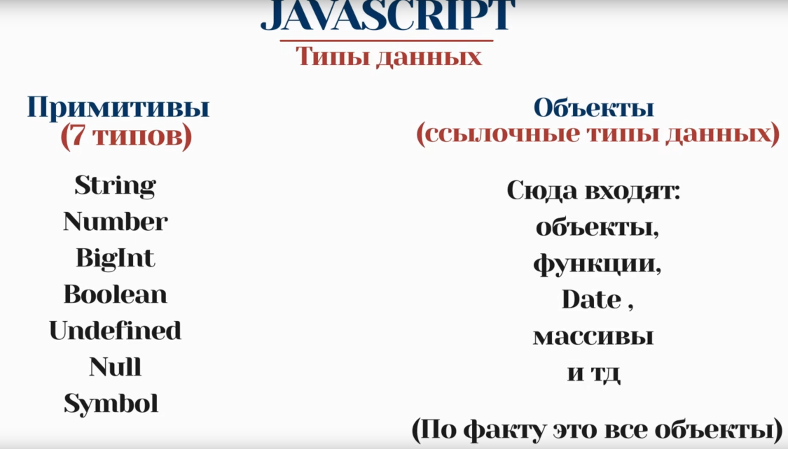
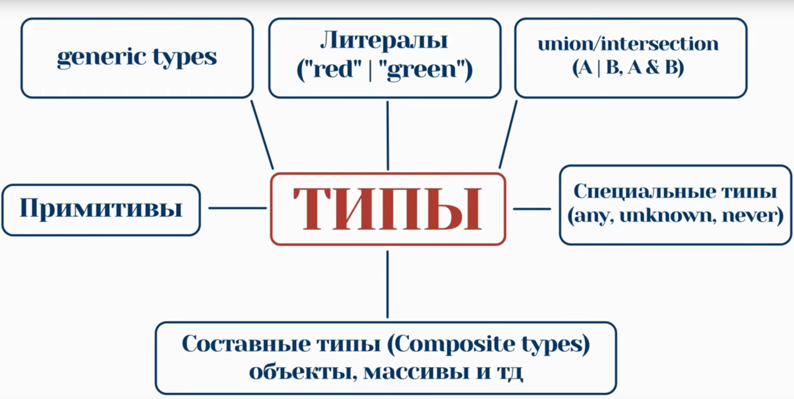

# 🚀 Изучение TypeScript

---

## 📌 Проблематика

### JavaScript — ~~НЕТИПИЗИРОВАН~~ (частая ошибка новичков)

JavaScript — язык со **слабой** и **динамической** типизацией:

| <span style="font-weight:bold">Слабая</span>                                                                                          | <span style="font-weight:bold">Динамическая</span>          |
| :------------------------------------------------------------------------------------------------------------------------------------ | :---------------------------------------------------------- |
| JS работает с разными типами данных с помощью <br> <span style="font-style:italic">неявного приведения типов</span> (_type coercion_) | Типы определяются в рантайме, а не на этапе компиляции кода |

#### Какие проблемы из-за этого?

- ❌ Сложность поддержки больших проектов — много данных, нет четкого описания
- ❌ При написании кода работу с типами приходится проводить вручную
- ❌ Дебаг и тестирование кода усложняются в разы
- ❌ Нет нормального автокомплита в IDE

---

## 🧩 Типы данных в JavaScript

<p align="center">
	
</p>

---

# 🟦 TypeScript

**TypeScript** — это всё, что есть в JS, плюс расширения.<br>
**TypeScript** — язык со **статической** (явной или выводимой) и **структурной** типизацией.

---

## 🏷️ Что такое _статическая типизация_?

> **Статическая типизация** — типы проверяются на этапе _компиляции_, а не _выполнения_.

- **Явная**: мы сами указываем типы
- **Выводимая**: TS сам определяет тип по присвоенному значению

---

## 🏗️ Что такое _структурная типизация_?

> Типы в TS **взаимозаменяемые**, если их структура совпадает.

```typescript
type User = {
	firstName: string;
	lastName: string;
};

type Person = {
	firstName: string;
	lastName: string;
};

const vasya: User = {
	firstName: 'Vasya',
	lastName: 'Pupkin',
};

function sayHello(person: Person): string {
	return `Hello! My name is ${person.firstName} ${person.lastName}`;
}

// User и Person взаимозаменяемы
console.log(sayHello(vasya));
```

---

## 🧬 Типы данных в TypeScript

<p align="center">
	
</p>

---

## 🏛️ Надтипы и подтипы

- **Надтип** — тип с набором полей
- **Подтип** — тип, который содержит все поля родителя + свои собственные

> **Подтип** можно присваивать **надтипу** (лишние поля игнорируются и недоступны).<br> > **Надтип** нельзя присваивать **подтипу** (не хватает нужных полей).

---

## 🧩 Обобщения (Generics)

**Обобщения (Generics)** — это способ создавать компоненты (функции, классы, интерфейсы), которые могут работать с разными типами данных, сохраняя при этом строгую типизацию. Тем самым мы делаем компоненты **динамическими**

> Generics позволяют писать универсальный и переиспользуемый код, не жертвуя безопасностью типов.

### Пример использования Generics

```typescript
function identity<T>(value: T): T {
	return value;
}

const num = identity(42); // тип number
const str = identity('hello'); // тип string
```

- `T` — это параметр типа, который задаётся при вызове функции.
- TypeScript автоматически выводит тип на основе переданного значения.

### Зачем нужны Generics?

- 📦 Позволяют создавать универсальные коллекции и функции (например, массивы, списки, обёртки).
- 🛡️ Сохраняют строгую типизацию: ошибки типов обнаруживаются на этапе компиляции.
- 🔄 Повышают переиспользуемость и читаемость кода.

---

## 🏷️ Приведение типов (Type Assertion)

**Type Assertion** — это способ явно указать TypeScript, что переменная имеет определённый тип. Это не преобразование типов во время выполнения, а только подсказка компилятору.

> Type Assertion сообщает TS: "Доверься мне, я знаю, что делаю!"

### Синтаксис

```typescript
const value: any = 'Hello, TypeScript!';
const strLength: number = (value as string).length;
// или альтернативный синтаксис:
const strLength2: number = (<string>value).length;
```

- `as Type` — современный и рекомендуемый синтаксис.
- `<Type>` — старый синтаксис (не работает в JSX).

### Когда использовать?

- Когда вы точно знаете тип значения, а TS не может его вывести.
- При работе с DOM, внешними библиотеками, legacy-кодом.
- В конфигурационных файлах, тестах, утилитарных функциях.
- При работе с HTML-элементами (иногда: если уверены в типе, иначе лучше использовать проверки, чтобы избежать ошибок в рантайме).

### Важно

- Type Assertion не меняет тип значения в рантайме — это только для компилятора.
- Используйте с осторожностью: неправильное приведение может привести к ошибкам.
- Не злоупотребляйте — старайтесь использовать только там, где TS действительно не может вывести тип самостоятельно.

---

## Различия типов Object и object для Constraints (ограничений)

| x               | Object | object |
| --------------- | ------ | ------ |
| Обычные объекты | Да     | Да     |
| Массивы         | Да     | Да     |
| Функции         | Да     | Да     |
| Примитивы       | Да     | Нет    |
| null/undefined  | Нет    | Нет    |

---

## 🔍 Операторы `typeof` и `keyof` в TypeScript

### `typeof`

В TypeScript оператор `typeof` используется в двух контекстах:

1. **В рантайме (JavaScript):**

   - Оператор `typeof` возвращает строку с типом значения.
   - Пример:
     ```javascript
     typeof 42; // "number"
     typeof 'hello'; // "string"
     ```

2. **На уровне типов (TypeScript):**
   - Позволяет извлекать тип переменной или значения для дальнейшего использования в аннотациях типов.
   - Пример:
     ```typescript
     const user = { name: 'Alice', age: 30 };
     type User = typeof user; // { name: string; age: number }
     ```

### `keyof`

Оператор `keyof` позволяет получить **множество ключей** типа объекта в виде строкового литерального типа.

- Пример:

  ```typescript
  type User = { name: string; age: number };
  type UserKeys = keyof User; // "name" | "age"
  ```

- Часто используется вместе с `typeof` для создания универсальных функций:
  ```typescript
  const user = { name: 'Alice', age: 30 };
  function getValue<T, K extends keyof T>(obj: T, key: K): T[K] {
  	return obj[key];
  }
  const name = getValue(user, 'name'); // тип string
  ```

---

## Enum

#### Обычный enum (enum)

Позволяет создавать набор именованных значений. При компиляции в JavaScript создаёт объект с двусторонним отображением (ключ ↔ значение), что увеличивает размер итогового кода.

```typescript
enum Direction {
	Up,
	Down,
	Left,
	Right,
}

const dir: Direction = Direction.Up;
console.log(dir); // 0
console.log(Direction[0]); // 'Up'
```

---

#### Константный объект (as const)

Используется для создания неизменяемого объекта с литеральными значениями. Не создает дополнительного кода при компиляции. (только сам обьект)

```typescript
const Direction = {
	Up: 0,
	Down: 1,
	Left: 2,
	Right: 3,
} as const;

type Direction = (typeof Direction)[keyof typeof Direction]; // Получаем 0 | 1 | 2 | 3

const dir: Direction = Direction.Up;
```

---

#### Константный enum (const enum)

Создаёт набор именованных значений, но при компиляции полностью удаляется из итогового кода, подставляя значения напрямую (inline). Это уменьшает размер кода, но такие enum нельзя использовать с динамическим доступом по ключу.

```typescript
const enum Direction {
	Up,
	Down,
	Left,
	Right,
}

const dir = Direction.Up; // 0
```

---

**Сравнение:**

| Характеристика            | Enum                    | Const Enum          | Const Object             |
| ------------------------- | ----------------------- | ------------------- | ------------------------ |
| Доступность в runtime     | Да                      | Нет                 | Да                       |
| Размер бандла             | Большой                 | Меньше              | Меньше                   |
| Типизация                 | Отличная                | Отличная            | Требует явного задания   |
| Двухстороннее отображение | Да                      | Нет                 | Нет                      |
| Удобство                  | Удобно для перечислений | Удобно для констант | Простое и гибкое решение |

---

## Type VS Interface

## type

- Для объявления литералов и примитивных значений
- Расширяется с помощью intersection
  - Выполняет больше работы
- Можно сделать кортеж
- Объявить функции удобно

# interface

- Расширяется с помощью `extends`
  - Выполняет меньше работы, чем через intersection
- Несколько интерфейсов с одним именем и разными полями будут объединены в один
- Немного не удобно
